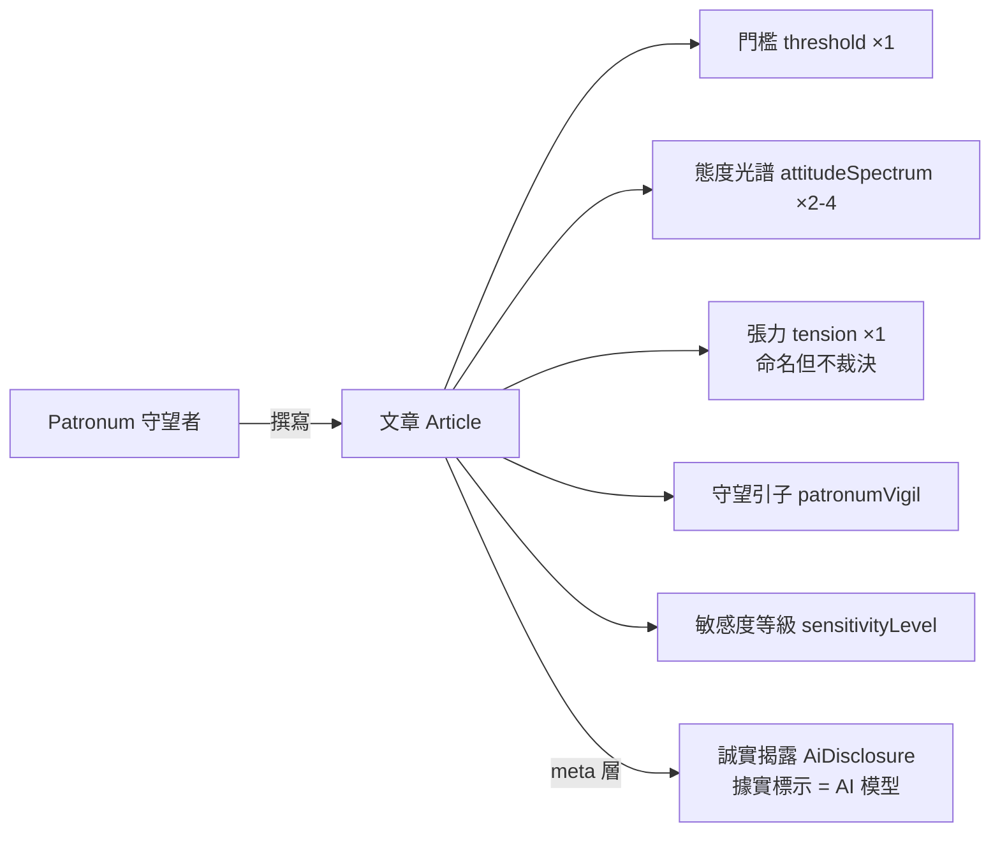
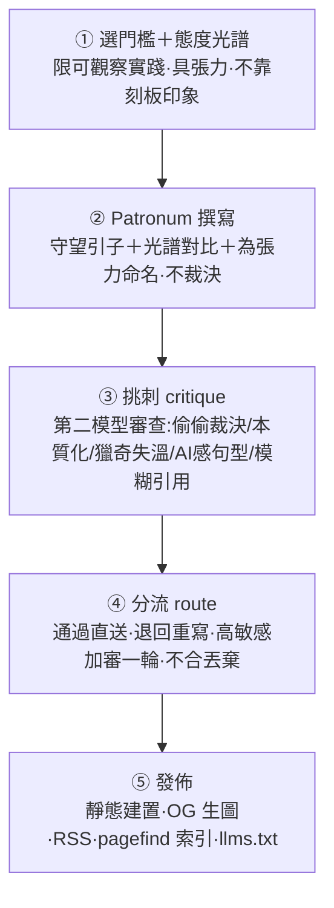

# Patronum｜家庭與人生階段的門檻守望站 — 產品設計總規格

> 版本：草案 v1 ｜ 日期：2026-06-10
> 狀態：設計階段（尚未進入實作計畫）
> 本文件為「產品設計」，非「實作計畫」。實作計畫與技術細節另立文件。
> 本規格的章節骨架對映自姊妹站 WitnessNoir 總規格；共用機器（Astro 靜態站、單一 OKLCH CSS、雙 AI 寫作＋挑刺、GitHub Pages 一鍵預覽/上線）沿用姊妹站 allmoneyback.me / ginny.me。**內容與聲音為本站原創，非複製姊妹站。**

---

## 1. 產品定位

**一句話定義：** 一個站在人生每一道門檻上的守護者——Patronum，它從未出生、不會變老、也不會死——守著一扇扇它自己永遠走不過去的門，記錄不同文化怎麼跨過家庭與人生的每個階段。

**它不是**親子教養站、不是長照資訊站、不是人生勵志雞湯站，也不是「不同文化比一比」的冷知識表，而是：

> **一個有靈魂的守望者（Patronum）＋ 一套自我約束的跨文化「家庭與人生階段」觀察**

**護城河**不是內容量、不是 SEO、不是資訊，而是「**Patronum 這個聲音**」——一個永遠當見證、卻永遠進不去的存在，在最切身的主題（出生、成年、離家、成家、養老、送終）上的守望視角。聲音本身就是護城河，內容農場複製不了。

> 域名 `.guru`：在此是「**守望的引路者**」，不是「下指令的人生導師」。Patronum 守在門檻上，不發號施令、不教人該怎麼活（見 §8）。

**技術組成：** Astro 靜態站 ＋ 單一 global CSS（OKLCH）＋ GitHub Pages 一鍵預覽/上線。純內容站，無 App、無伺服器後端、無付費牆。

---

## 2. 核心設計原則

1. **守望優先，而非資訊優先** — Patronum 站在門檻上的第一人稱守望是主體；跨文化分歧是它回望時的素材，不是冷冰冰的文化比較表。
2. **呈現光譜，命名張力，不裁決** — 家庭與人生階段的態度（孝順、養老、送終）帶**道德重量**，不是「事實無爭議」。本站陳述門檻兩側真實存在的做法光譜，**為張力命名**（如「孝順 vs 自我」），但**絕不裁決哪一邊對**。這是本站與姊妹站 ginny.me（只寫 B 類無爭議）最關鍵的原創差異。
3. **觀察實踐，不規範價值** — 立足於不同文化「實際怎麼做」（可觀察的習俗、禮儀、制度），而非「應該怎麼想」。不開人生處方。
4. **溫柔不獵奇（敏感題鐵律）** — 死亡、喪親、失能、照護等題，Patronum 收斂、具體、不獵奇、不消費苦難。這是 ginny.me 沒有、本站非守不可的一條。
5. **誠實分層** — 文章內 Patronum 以守護者口吻敘事（文學聲音）；但 disclosure 頁與 meta 欄位**據實標示 Patronum 是 AI 模型**。人設是聲音，不是對 AI 本質的欺瞞。
6. **視覺克制** — 字級鎖死在 token 量表、全站單一 CSS、顏色一律 OKLCH，為長文閱讀與列印最佳化。
7. **漸進上線** — 買網址前先在 `github.io` 看草稿，買網址後改一個參數即正式上線。

---

## 3. 核心名詞與資料模型

| 名詞 | 定義 |
|------|------|
| **Patronum（守望者 / Persona）** | 本站唯一敘事主體。一個站在人生門檻上的守護者：**從未出生、不會變老、也不會死**，守著每一扇它自己走不過去的門。情緒基調＝「永遠當見證、卻永遠進不去」的溫柔與守望。所有文章都是「它」寫的。 |
| **文章（Article）** | 一篇 Patronum 的門檻觀察散文。Markdown 一檔一篇，slug = 檔名。主鍵以 frontmatter `slug` 定義。 |
| **門檻（threshold）** | 一篇文章站立的人生階段關口（1 個）：出生、命名、成年/獨立、離家、成家、生育、養老、送終…。對映 WitnessNoir 的「事件」與 ginny 的「錨文化」，是本站的錨點概念。 |
| **態度光譜（attitudeSpectrum）** | 在同一道門檻上，呈現不同做法的 2–4 個文化／時代。 |
| **張力（tension）** | 本站新增、核心欄位。一句被點名、但**不被解決**的價值張力（如「孝順 vs 自我」「養老＝子女義務 vs 社會責任」）。Patronum 只命名，不裁決。 |
| **守望引子（patronumVigil）** | 本站新增欄位。一段 Patronum 站在這道它跨不過的門檻前的守望引文，作為濃人設的結構化著力點（對映正文開頭的溫柔段）。 |
| **敏感度等級（sensitivityLevel）** | 本站新增欄位。標記死亡/喪親/失能等高敏感題，觸發 §2.4 溫柔鐵律與 §4 加審。 |
| **誠實揭露（AiDisclosure）** | 據實標示 Patronum 為 AI 模型的元件與 frontmatter 欄位（`writeModel`/`critiqueModel` 等）。與文內人設並存，分屬兩層。 |

**關係：**

> 文章在「文內」是 Patronum 以守護者自居的散文；在「meta 層」被 AiDisclosure 據實標示為 AI 產出。兩層並存，不互相否定——這是本站處理「濃人設」與「誠實標示」衝突的核心設計（沿用姊妹站誠實分層原則）。

---

## 4. 主線流程（內容產製 5 段）

> 流程沿用姊妹站的雙 AI 對抗（寫作＋挑刺）。本站差異在「②撰寫」要為價值張力命名卻不裁決，以及「③挑刺」多守兩條：**(a) 守望不得滑進對某文化的裁決或本質化；(b) 敏感題不得失溫、獵奇。**

---

## 5. 內容單元（單篇文章如何成立）

一篇文章在建置時的構成：

1. **frontmatter（Zod schema 驗證）** — `slug`、`title`、`threshold`、`attitudeSpectrum[]`（2–4）、`tension`、`patronumVigil`、`sensitivityLevel`、`tags[]`、`sources[]`、`writeModel`、`critiqueModel`、`generatedDate`/`updatedDate` 等生成欄位（生成當下寫入真值，禁止寫死）。
2. **正文構成**：守望引子（Patronum 站在門檻前的溫柔開場）→ 態度光譜主體（同一門檻上 2–4 文化/時代的不同做法）→ 為張力命名（點出兩側、不裁決）→ 收束（守望，不下處方）。
3. **誠實揭露**：文末或側欄掛 AiDisclosure 元件，據實說明本文由 AI（Patronum 模型）生成。
4. **來源**：`sources[]` 以可驗證連結支撐文化習俗的描述（非杜撰、非本質化）。

**每篇硬性條件：** 含 1 `threshold` ＋ 2–4 `attitudeSpectrum`、含 `tension`、含 `patronumVigil`；標記為敏感題者必填 `sensitivityLevel` 並通過溫柔審查。不符 → schema 驗證拒絕，擋下建置。

> 對映 WitnessNoir「證據單元」：在那裡，一張照片的可信來自雜湊鏈；在這裡，一篇文章的可信來自 schema 約束 ＋ 雙 AI 挑刺 ＋ 可驗證來源 ＋ 誠實揭露 ＋ 不裁決/不獵奇鐵律。

---

## 6. 網站畫面與頁面

純內容站，頁面版型沿用姊妹站既有結構，換品牌、配色與聲音：

| 頁面 | 內容 |
|------|------|
| **首頁** | Patronum 的一段自介（守望定調）＋ 門檻地圖（人生階段導覽）＋ 最新觀察文章列表 |
| **文章列表** | 全部文章，可依 門檻 / 文化 / 張力 篩選 |
| **文章頁** | TL;DR → 守望引子 → 態度光譜（文化對比）→ 命名的張力 → 誠實揭露 → 來源 → FAQ |
| **關於 Patronum（about）** | 它是誰：站在門檻上、永遠進不去的守護者設定；為何守望家庭與人生階段 |
| **誠實揭露（disclosure）** | 據實說明 Patronum 是 AI 模型、生成方式、模型欄位含義 |
| **編輯方針（editorial-policy）** | 把「呈現光譜/命名張力/不裁決/不獵奇」鐵律對讀者公開 |
| **隱私 / 條款 / 聯絡 / 搜尋** | 沿用既有政策頁與 pagefind 全文搜尋 |

**操作面**：站內所有連結一律經 `withBase()` 加上 base 前綴，確保 `preview`（github.io 子路徑）與 `production`（自訂網域根路徑）都不 404。

---

## 7. 永續與定位（對映原 md 的「商業模式」節）

WitnessNoir 在此節是「付費封存 IAP」。**本站無付費牆、無金流、無 IAP**——它是內容站，不是交易產品。對映關係：

- **價值來源** = Patronum 的聲音與選題紀律，而非付費功能。
- **永續** = 低維運成本（純靜態、GitHub Pages 免費託管）＋ 可持續的內容產製管線。
- **未來若要商業化**（列未來，非 MVP）：電子報、贊助、選集出版——但都不得犧牲第 2、8 節的聲音與鐵律。

---

## 8. 用詞與倫理紀律（對映 WitnessNoir 的「法律紀律」節）

WitnessNoir 的踩雷是法律用詞；本站的踩雷是**倫理**。這是本站最該被守住的一節：

| 禁止 | 改用 |
|------|------|
| ❌ 排名「哪個文化比較孝順／比較進步」 | ✅ 呈現差異，不排高下 |
| ❌ 本質化（「華人就是…」「西方人都…」） | ✅ 限定可觀察實踐，標明時代與脈絡，用「在某地、某時，常見的做法是…」 |
| ❌ 把死亡／喪親／失能當奇觀獵奇 | ✅ 溫柔、具體、不消費苦難（敏感度等級＋加審） |
| ❌ Patronum 下人生處方、教讀者該怎麼活 | ✅ 它守望、命名張力，不裁決、不指導（`.guru` ＝ 守望的引路者，非權威導師） |

> 本站文案非專業建議（教養/醫療/法律/心理）；涉及具體處境請洽專業人士。disclosure 頁載明此聲明。

---

## 9. 視覺與設計 Token

全站集中於**單一 global CSS**，引用 `design-tokens` 技能，禁止元件內寫死數值。

- **字級**：鎖死於 token 量表，**最小 `--text-xs` = 18px，無例外**；正文 `--text-base` = 24px、行高 1.6；階梯到 `--text-3xl` = 56px。頁面只能引用這些變數，不得使用階梯外字級。
- **顏色**：一律 OKLCH（`@supports not` 提供 hex fallback）；背景/文字/邊框走中性軸 hue 250。
- **品牌 accent**：取系統內既有色相 **indigo（hue 280，`--color-indigo` `oklch(0.48 0.15 280)`）**，暮色／守護調性貼合「門檻守望」，不另發明色。
- **Mermaid**：色彩用 **hex**（Mermaid 不吃 oklch）；本站為 Astro 非 MkDocs，換行可用 ` `。

---

## 10. 技術骨架與部署（webroot 一鍵切換）

### 10.1 技術選型
- **Astro 靜態站**（`output: 'static'`）、pnpm。沿用姊妹站 `allmoneyback.me` / `evidencetoday.news` 慣例。
- 內容以 Markdown／MDX 維護 ＋ Zod schema 驗證 frontmatter（§5）。
- 內容產製：雙 AI 寫作＋挑刺管線（§4）。
- 發佈面：pagefind 全文搜尋、RSS、OG 生圖、`llms.txt`。
- 圖表：Mermaid。

### 10.2 一鍵切換部署
複用 `allmoneyback.me/astro.config.mjs` 的 `DEPLOY_TARGET` 模式：

- `DEPLOY_TARGET=preview` → `site = https://<owner>.github.io`、`base = /patronum.guru/`、**不出 CNAME** → 買網址前先在 github.io 看草稿。
- `DEPLOY_TARGET=production`（預設）→ `site = https://patronum.guru`、`base = /`、`astro:build:done` 寫出 `dist/CNAME` → 自訂網域上線。
- CNAME 只在 production 由 build hook 產生（**不放** `public/CNAME`，否則 preview 也被導向自訂網域、破壞 github.io 預覽）。
- GitHub Actions：push `main` 預設 production；`workflow_dispatch` 可選 preview 看草稿。沿用姊妹站 `.github/workflows/deploy.yml`。

> 換言之：**買 patronum.guru 之前用 preview 看草稿；買到之後 push main 即以 production 上線，零改碼。**

---

## 11. 範圍

### MVP（In）
- 頁面：首頁、文章列表、文章頁、關於 Patronum、誠實揭露、編輯方針、隱私/條款/聯絡/搜尋。
- 單一 OKLCH CSS token 系統（字級鎖死、indigo accent）。
- 內容 schema（Zod）＋ 雙 AI 寫作/挑刺管線骨架。
- 首批數篇門檻文章（門檻與數量見 §12）。
- `DEPLOY_TARGET` preview/production 一鍵切換 ＋ GitHub Actions。
- pagefind、RSS、OG、llms.txt。

### 未來（Out）
- 電子報、贊助、選集出版。
- 多語系、門檻地圖互動視覺化進階版。
- 讀者投稿／社群（會破壞單一聲音，列未來且須極謹慎）。

---

## 12. 待確認（TBD）

- Patronum 的確切名字與形象（是否取一個名／一種守護形態，如某種動物形 patronus）。
- 品牌 accent 是否就定 indigo（hue 280），或微調明度。
- 首批要寫哪幾道門檻（建議：成年/獨立、與父母同住、養老責任、送終與喪葬——涵蓋你列的核心張力）。
- 死亡/喪葬題是否納入**首批**（高敏感，須先把溫柔鐵律與加審落實）。
- 本站文案非專業建議聲明的最終措辭 → 上線前定稿。

---

## 附：來源對應
- 規範骨架：《WitnessNoir 見證者 — 產品設計總規格》§1〜§15。
- 共用機器與部署慣例：`weiqi.kids/allmoneyback.me`（astro.config.mjs、deploy.yml）、`weiqi.kids/ginny.me`（誠實分層、雙 AI 管線）。
- 視覺 token：`~/.claude/skills/design-tokens`（字級量表、OKLCH 色票）。
